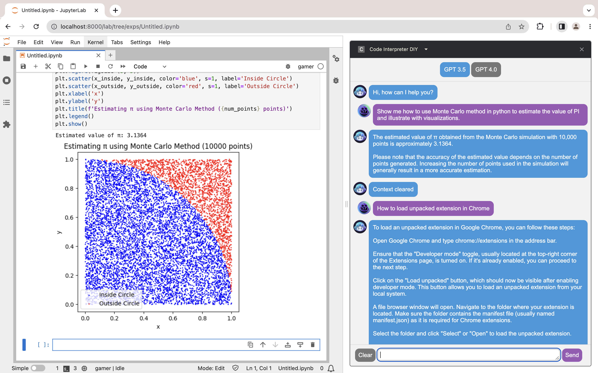
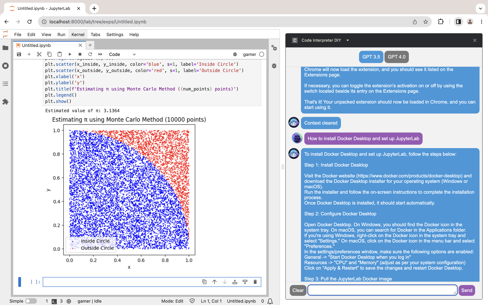
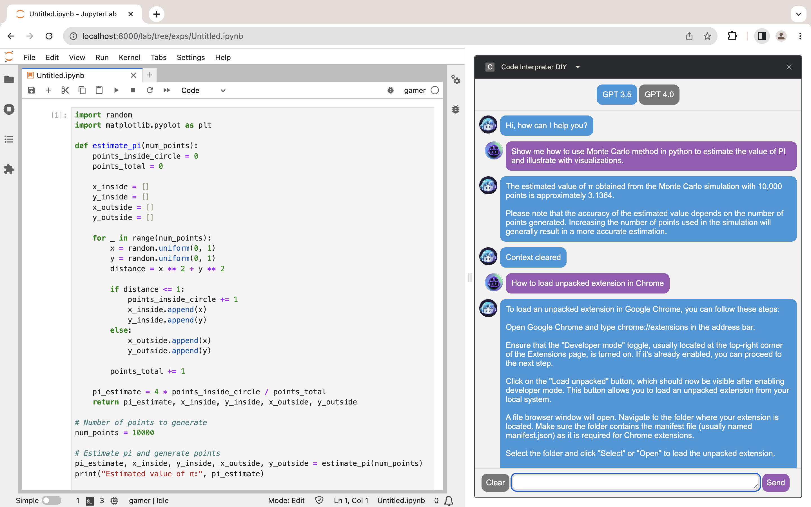

# 💡 DIY Code Interpreter in Chrome

  
   
  Click the <strong>image</strong> to watch long video on YouTube. For short video on Twitter, <a href="[http://www.youtube.com/watch?v=ID](https://twitter.com/HaveFunWithAI/status/1681358161800839208?s=20)">click <strong>here</strong></a>.

**TL; DR**: ChatGPT meets JupyterLab in Chrome (connected by extension). 
- ChatGPT brings chat/code interface backed by LLMs, as translator between human and computer. 
- JupyterLab brings graphical I/O interface and customizable environment, has access to internet, local storage and local compute. 

## Table of Contents

- [Overview](#overview)
- [Examples](#examples)

## Overview

- code-interpreter-diy/
    - assets/
        - 0-code.png
        - 1-chat.png
        - 2-chat.png
        - bot-icon.png: 128x128, from Github Copilot
        - user-icon.png: 128x128, from Github Copilot X
    - README.md
    - manifest.json
    - [ ] sidepanel.html

- [Install Chrome](https://www.google.com/chrome/) and this extension (sidepanel.html in development)
    - Go to Settings -> Extensions, open Developer mode
    - Click Load unpacked, select the `extension` folder
- [Install Docker Desktop on Mac](https://docs.docker.com/desktop/install/mac-install/) 
    - Download Desktop for Mac with Apple silicon
    - Install Docker Desktop and open it
- Set up Jupyter in Docker and use JupyterLab in Chrome
    - Go to Images, search `jupyter`, pull the `datascience-notebook` image and run it
    - Set up name and port (e.g. 3000)
    - Go to Containers, run the container and get initial token in `Logs`
    - Go to localhost:3000 in Chrome, paste initial token to log in for the first time (then set up a password for future logins)
    - See [JupyterLab Documentation](https://jupyterlab.readthedocs.io/en/latest/) for more information

  
  
  
Clear context then ask how to load Chrome extension and how to set up Jupyter environment (required for this project).

## Examples

  
  
  
Estimate π using Monte Carlo method then visualize.

